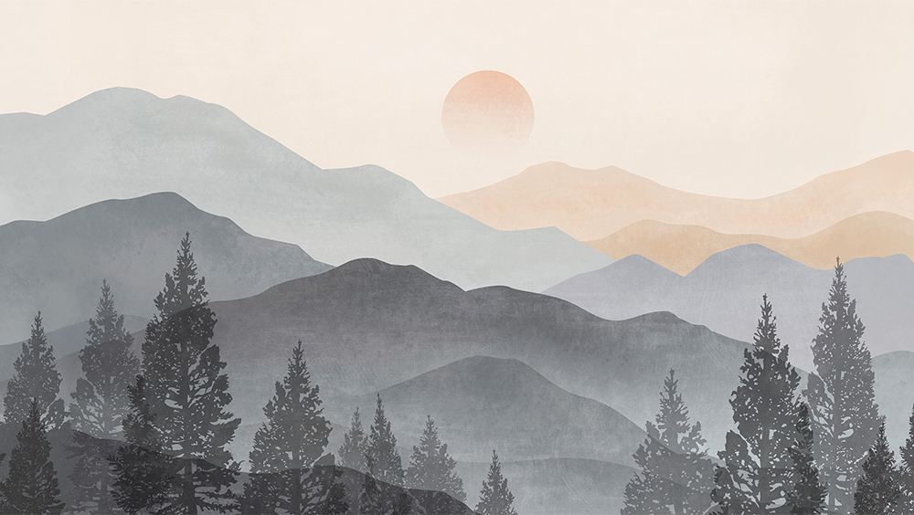
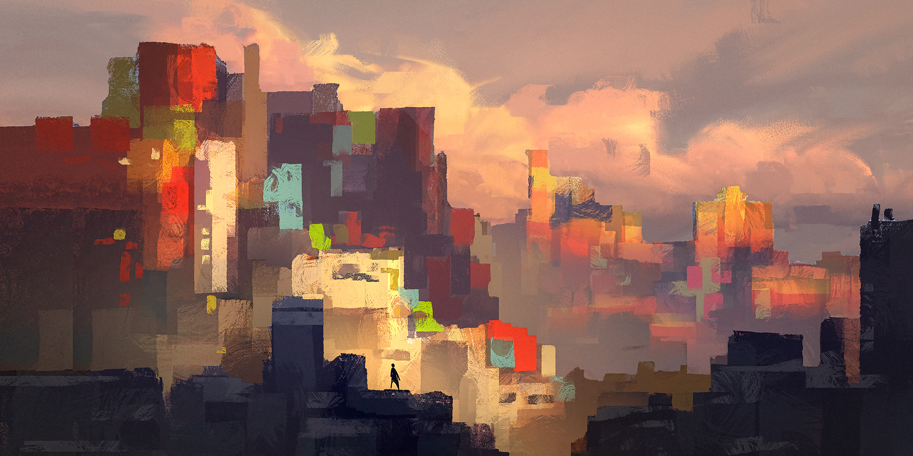

# Creative Commons Attribution-ShareAlike 4.0

## Anastasia Turkova

**Grey mountain landscape**

Source: [Wikimedia Commons](https://commons.wikimedia.org/wiki/File:Grey_mountain_landscape_Anastasia_Turkova.jpg)

## Fedora 26 Default Wallpaper

By: Kyle R. Conway and Máirín Duffy

Source: [fedoradesign/backgrounds](https://github.com/fedoradesign/backgrounds/tree/f26-backgrounds)

**Day**

**Dawn**

**Dusk**

**Night**

## Raghavendra Kamath

**Sunset - Landscape digital painting made in Krita**

Source: [Wikimedia Commons](https://commons.wikimedia.org/wiki/File:Sunset_-_Landscape_digital_painting_made_in_krita.png)

## Stephane Wootha Richard

**Golden Hour in Squares**

Source: [Wikimedia Commons](https://commons.wikimedia.org/wiki/File:Golden_Hour_in_Squares.jpg)
